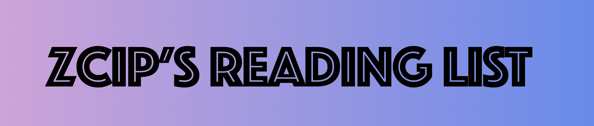

  

## Tech Stack

### Frameworks

- [Astro](https://astro.build/) A modern web development platform for building fast, scalable, and modern static websites

### Platforms

- [Netlify](https://www.netlify.com/) All-in-one platform for automating modern web projects

### UI

- [Tailwind CSS](https://tailwindcss.com/) – Utility-first CSS framework for rapid UI development

### Code Quality

- [TypeScript](https://www.typescriptlang.org/) – Static type checker for end-to-end typesafety
- [Prettier](https://prettier.io/) – Opinionated code formatter for consistent code style
- [ESLint](https://eslint.org/) – Pluggable linter for Next.js and TypeScript
- [lint-staged](https://github.com/okonet/lint-staged) - A tool that runs linters on files staged for committing in Git.

## Developments

1. Clone the repository.
2. Install dependencies with `npm install`.
3. Start the development server with `npm run dev`.
